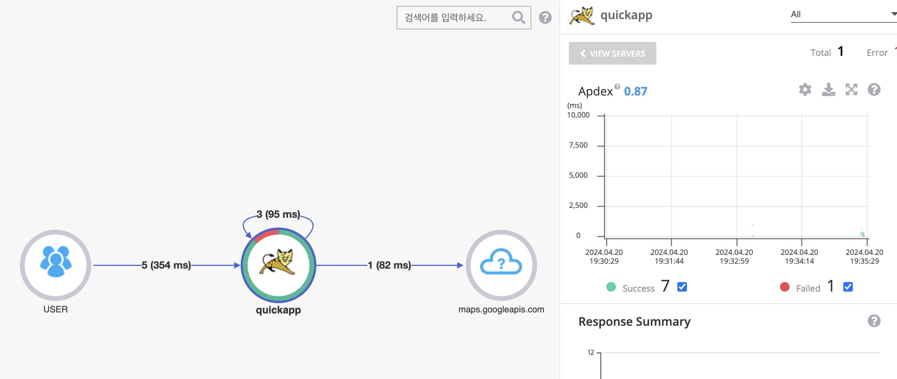

성능 테스트 환경을 구축하기 위해서 로컬에 nGrinder를 설치하고 애플리케이션 서버나 새로운 서버를 구축해서 PINPOINT를 활성화 시키는 방법에 대해서 설명합니다. 환경설정에 대한 글이기 때문에 각 도구의 사용방법에 대해서는 자세히 설명하지 않습니다.

> 여러 시행착오를 거친 후 결국 Docker가 짱이라는 생각이 박히게 되었다.

## nGrinder
nGrinder를 설치할 수 있는 방법은 다양한다.
- nGrinder Controller, Agent 파일을 다운 받아서 각각 실행하기
- Docker를 통해 설치하기
    - Docker 명령어를 직접 입력하기
    - Docker Compose 로 설치

나는 여기서 Docker Compose를 통할 설치를 선택했다. docker-compose.yml 파일만 잘 작성해놓는다면 다음에 다른 환경에서 필요할 때 파일만 복사해 설치/실행 명령어 하나만 입력하면 되기 때문이다.

```yml
version: '3.8'
services:
  controller:
    image: ngrinder/controller
    restart: always
    ports:
      - "9000:80"
      - "16001:16001"
      - "12000-12009:12000-12009"
    volumes:
      - ./ngrinder-controller:/opt/ngrinder-controller
  agent:
    image: ngrinder/agent
    restart: always
    links:
      - controller
```

- 실행을 마친 후 [localhost:9000](localhost:9000)으로 접속하면 웹 UI에 접속할 수 있다.
- 우상단의 메뉴에서 Agent Management 를 클릭해서 Agent도 잘 감지되는지 확인하자. 

## PINPOINT
원래는 핀포인트가 아닌 그라파나(Grafana)를 사용했다. 그라파나로도 메모리 상황, CPU 점유율, 데이터베이스 커넥션 수 등등 여러가지 프로파일 정보를 시각화 해주는 좋은 툴이다. 하지만 정확히 애플리케이션의 어느 부분에서 문제가 있는지는 보여주지 않는다. 핀포인트는 프로파일 정보 뿐만 아니라 애플리케이션의 요청 흐름을 topology 도식으로 보여준다. 흐름뿐만아니라 해당 흐름이 몇번 호출되었고, 어디서 부하가 일어나는지도 따로 표시해준다. 이러한 장점 덕분에 문제가 발생한 지점을 좀더 빠르게 파악할 수 있게 된다.

### 구축 흐름
핀포인트를 사용하기 위해서는 크게 Controller와 Agent를 설치해야합니다. HBase등 과거이력을 보기 위해서 추출한 정보를 저장해두는 데이터베이스도 설치가 필요하지만 Docker Compose를 사용해서 설치한다면 크게 신경쓸 필요는 없습니다.


핀포인트 서버에 컨트롤러를 설치하고 운영 서버에서 웹 애플리케이션과 핀포인트 에이전트를 함께 실행시키면 됩니다.

> 핀포인트 서버는 메모리 용량이 `16GB` 이상인 환경에서 구축할 것을 권장하고 있습니다. 핀포인트가 띄워질 때 사용되는 메모리가 `13~15GB`정도이기 때문입니다. 필자는 처음에 `1코어, 2GB 메모리 환경`에서 핀포인트 서버를 구축했다가 머신이 완전히 멈추어버리는 문제를 겪었다.
{: .prompt-warning }

핀포인트 서버는 따로 VM을 구성하지 않고 로컬에서 실행하기로 하였다.

### 핀포인트 Controller 설치
[핀포인트 Quick Start 가이드](https://pinpoint-apm.github.io/pinpoint/quickstart.html)를 보면 여러가지 설치법이 소개되어 있다. 나는 이 중에서 가장 편리한 도커를 이용한 설치를 진행하려고한다. [공식 핀포인트 Docker 레포지토리](https://github.com/pinpoint-apm/pinpoint-docker)에 도커를 활용한 설치법이 자세히 설명되어 있다.

```sh
git clone https://github.com/pinpoint-apm/pinpoint-docker.git
cd pinpoint-docker
docker-compose pull && docker-compose up -d
```
위와 같은 세개의 명령만으로 도커 이미지 파일을 다운받고 서버를 실행할 수 있다.

Pinpoint v2.5.0부터 URI 메트릭과 인프라 메트릭이 추가되었는데 이 메트릭을 사용하기 위해서는 docker-compose-metric.yml 파일을 함께 docker compose 설정파일에 추가해야한다. 아래의 명령으로 수행하면 된다. 

```sh
git clone https://github.com/pinpoint-apm/pinpoint-docker.git
cd pinpoint-docker
docker-compose pull
docker-compose -f docker-compose.yml -f docker-compose-metric.yml up -d
```

이후 `http://{핀포인트 서버 도메인/IP}:8080`로 접속하면 핀포인트에 접속할 수 있다. 나는 로컬에서 구축했기 때문에 [http://localhost:8080](http://localhost:8080)로 접속했다. 

도메인에 접속해보면 에이전트 테스트를 위한 QuickStart앱으로 에이전트 테스트를 해볼 수 있다.



`http://{핀포인트 서버 도메인/IP}:8085`로 접속해서 quickapp에 대한 요청을 보내 테스트를 진행해볼 수 있다.


QuickStart앱은 에이전트 테스트를 위한 앱이기 때문에 운영환경에서는 제외해야한다. <br>
docker-compose.yml 파일에서 services 목록 중 

- `pinpoint-quickstart`
- `pinpoint-agent` 

두 가지를 삭제하거나 주석처리 해주면 된다.

### 핀포인트 Agent 설치
핀포인트 컨트롤러는 로컬이나 별도의 서버에. 애플리케이션에 붙이는 것은 에이전트 뿐이다.

애플리케이션을 빌드하면서 핀포인트가 띄워진 서버와 연동을 시도해야한다. 나는 프로젝트 빌드를 Dockerfile로 진행하고 있기 때문에 일단 작성된 Dockerfile을 보면서 설명하겠다.

```dockerfile
FROM openjdk:17-oracle as builder
WORKDIR /backend
ADD https://github.com/pinpoint-apm/pinpoint/releases/download/v2.5.3/pinpoint-agent-2.5.3.tar.gz /usr/local
RUN tar -zxvf /usr/local/pinpoint-agent-2.5.3.tar.gz -C /usr/local

# 핀포인트 설정정보 업데이트
RUN sed -i 's/profiler.transport.grpc.collector.ip=127.0.0.1/profiler.transport.grpc.collector.ip={핀포인트 서버 IP}/g' /usr/local/pinpoint-agent-2.5.3/pinpoint-root.config
RUN sed -i 's/profiler.collector.ip=127.0.0.1/profiler.collector.ip={핀포인트 서버 IP}/g' /usr/local/pinpoint-agent-2.5.3/pinpoint-root.config

ARG JAR_FILE=build/libs/gongnomok-app.jar
COPY ${JAR_FILE} app.jar

EXPOSE 8000

ENTRYPOINT [ "java", "-jar", \
"javaagent:/usr/local/pinpoint-agent-2.5.3/pinpoint-bootstrap-2.5.3.jar", \
"-Dpinpoint.applicationName=gongnomok", \
"-Dpinpoint.config=/usr/local/pinpoint-agent-2.5.3/pinpoint-root.config", \
"-Dspring.profiles.active=dev", \
"/app.jar" ]

VOLUME [ "/tmp" ]
```

- [핀포인트 에이전트 Github 릴리스](https://github.com/pinpoint-apm/pinpoint-docker/releases)에서 압축파일을 가져와서 압축해제한다. 나는 `2024-04-20` 기준 가장 최근버전인 `2.5.3` 버전으로 설치하였다.
- 그리고 에이전트가 추출한 데이터를 컨트롤러에 보낼 수 있도록 설정정보의 수정이 필요하다.
    - pinpoint-root.config의 기본 localhost IP(`127.0.0.1`) 에서 핀포인트 서버 IP로 변경해준다.
- 빌드 시 agent 내용을 함께 실행한다.

이러한 과정을 마치고 핀포인트 서버의 8080 포트로 접속하면 핀포인트 UI화면을 볼 수 있다.


## 관련 문서
- [핀포인트 Docker 문서](https://github.com/pinpoint-apm/pinpoint-docker)
- [핀포인트 Agent 설치 문서](https://pinpoint-apm.github.io/pinpoint/installation.html#5-pinpoint-agent)
- [핀포인트 아키텍쳐 Overview](https://pinpoint-apm.github.io/pinpoint/overview.html#architecture)

## 트러블 슈팅
### Error while fetching files from SVN for admin
- 도커 홈 디렉토리를 삭제하고 다시 실행하면 해결된다? -> ❌
- jdk 11 까지만 지원하기 때문에 jdk 버전을 바꾸어 본다 -> ❌
- 직접설치하는 방식을 포기하고 docker compose를 사용해서 컨트롤러와 에이전트를 돌리는 방식으로 방향을 회피했다. 해결못함...

### Unsupported class file major version 61
- PINPOINT에 있는 gradle과 JDK의 버전이 맞지 않아 생기는 에러.
- 에러 메세지 뒤의 `61`이라는 숫자가 JDK 버전에 따라 다르다고 한다. 이 숫자는 JDK 17과는 호환되지 않아 발생한 에러였다.
- JDK 버전을 11로 다운그레이드 시켜 해결하였다.

PINPOINT jar파일을 다운받고 실행하는 과정에서 발생한 에러였다. 하지만 결국에는 도커를 사용해서 핀포인트를 설치했기에 고민할 필요가 없어졌다.